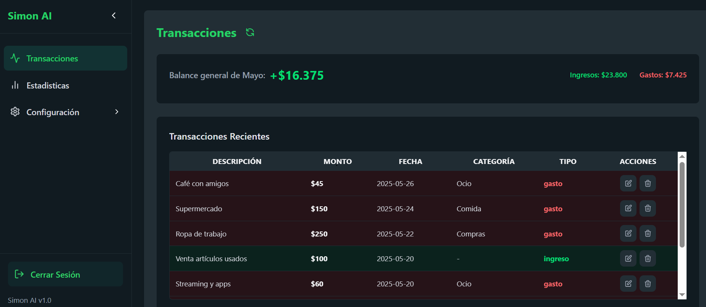
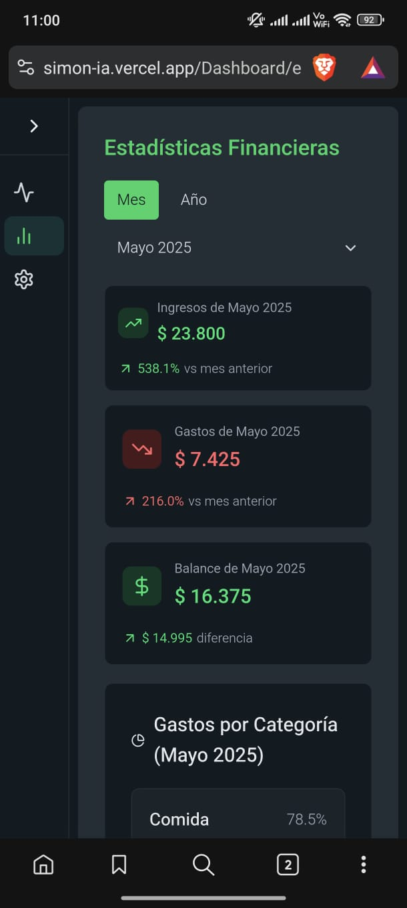
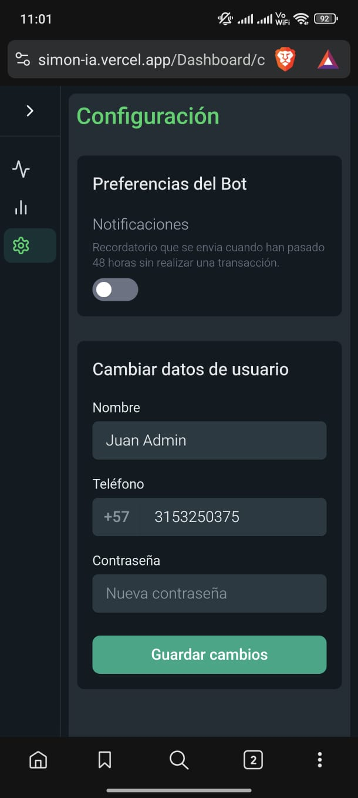

# 🤖 SimonIA - Asistente Financiero Inteligente

<div align="center">
  
  
  ### Tu Asistente Financiero Personal en WhatsApp
  
  [](https://simon-ia.vercel.app/)
  [](https://reactjs.org/)
  [](https://vitejs.dev/)
  [](https://tailwindcss.com/)
  [](https://supabase.com/)
</div>

## 📋 Descripción

**SimonIA** es un chatbot financiero inteligente que revolutiona la manera en que gestionas tus finanzas personales. A través de una interfaz web moderna y integración con WhatsApp, SimonIA te permite:

- 💰 **Registrar gastos e ingresos** de forma natural y conversacional
- 📊 **Ver reportes mensuales** detallados con análisis inteligentes
- 📈 **Obtener estadísticas** visuales de tus patrones financieros
- 🎯 **Recibir recomendaciones** personalizadas para mejorar tu salud financiera
- 📱 **Gestionar desde WhatsApp** o desde la plataforma web

## 🌟 Características Principales

### 🚀 **Funcionalidades Core**

- **Gestión de Transacciones**: Registro automático de ingresos y gastos con categorización inteligente
- **Reportes Mensuales**: Análisis detallados con gráficos interactivos y tendencias
- **Dashboard Interactivo**: Visualización en tiempo real de tu situación financiera
- **Notificaciones Inteligentes**: Recordatorios y alertas personalizadas
- **Exportación de Datos**: Descarga tus datos financieros en formatos legibles

### 🎨 **Interfaz de Usuario**

- **Diseño Responsivo**: Optimizado para móvil, tablet y desktop
- **Tema Oscuro**: Interfaz moderna inspirada en WhatsApp
- **Animaciones Fluidas**: Experiencia de usuario premium con Framer Motion
- **Navegación Intuitiva**: Estructura clara y fácil de usar

### 🔒 **Seguridad y Privacidad**

- **Autenticación Segura**: Sistema de login robusto
- **Cifrado de Datos**: Protección end-to-end de información financiera
- **Política de Privacidad**: Transparencia total en el manejo de datos
- **Términos y Condiciones**: Marco legal claro y accesible

## 📸 Capturas de Pantalla

### 🏠 Página Principal

La landing page presenta SimonIA con un diseño moderno y llamativo, explicando las funcionalidades principales.

### 💳 Panel de Transacciones


_Vista del panel principal donde se gestionan todas las transacciones financieras_

### 📊 Estadísticas Anuales


_Análisis detallado de transacciones por año con gráficos interactivos_

### 📱 Vista Móvil - Estadísticas


_Interfaz optimizada para dispositivos móviles_

### 👤 Perfil de Usuario


_Panel de configuración y gestión de perfil de usuario_

## 🛠️ Tecnologías Utilizadas

### **Frontend**

- **React 19.1.0** - Framework principal
- **Vite 6.3.5** - Build tool y desarrollo
- **Tailwind CSS 4.1.6** - Framework de estilos
- **Framer Motion 12.10.5** - Animaciones
- **React Router Dom 7.6.0** - Navegación
- **Lucide React** - Iconografía moderna

### **Backend & Base de Datos**

- **Supabase** - Backend as a Service
- **PostgreSQL** - Base de datos relacional
- **Real-time subscriptions** - Actualizaciones en tiempo real

### **Herramientas de Desarrollo**

- **ESLint** - Linting y calidad de código
- **Vercel** - Deployment y hosting

## 🚀 Instalación y Configuración

### **Prerrequisitos**

- Node.js 18+
- npm o yarn
- Cuenta de Supabase

### **1. Clonar el Repositorio**

```bash
git clone https://github.com/tu-usuario/simon-ia.git
cd simon-ia
```

### **2. Instalar Dependencias**

```bash
npm install
```

### **3. Configurar Variables de Entorno**

Crea un archivo `.env.local` en la raíz del proyecto:

```env
VITE_SUPABASE_URL=tu_supabase_url
VITE_SUPABASE_ANON_KEY=tu_supabase_anon_key
```

### **4. Ejecutar en Desarrollo**

```bash
npm run dev
```

### **5. Build para Producción**

```bash
npm run build
```

## 📁 Estructura del Proyecto

```
📦 simonIA/
├── 📂 public/                    # Archivos estáticos
│   ├── 📸 estadisticas_mobile.jpg
│   ├── 📸 PerfilPage.jpg
│   ├── 📸 Transacciones anio.PNG
│   └── 📸 transacciones.PNG
├── 📂 src/
│   ├── 📂 components/            # Componentes React
│   │   ├── 📂 AuthPage/         # Autenticación
│   │   ├── 📂 DashBoard/        # Panel principal
│   │   └── 📂 home/             # Landing page
│   ├── 📂 context/              # Context API
│   ├── 📂 Hooks/                # Custom hooks
│   ├── 📂 models/               # Modelos de datos
│   ├── 📂 pages/                # Páginas principales
│   ├── 📂 Routes/               # Configuración de rutas
│   ├── 📂 supabase/             # Configuración backend
│   └── 📂 utils/                # Utilidades
├── 📄 package.json              # Dependencias
├── 📄 tailwind.config.cjs       # Configuración Tailwind
└── 📄 vite.config.js            # Configuración Vite
```

## 🎯 Funcionalidades Detalladas

### **Gestión de Transacciones**

- ✅ Registro de ingresos y gastos
- ✅ Categorización automática
- ✅ Edición y eliminación de transacciones
- ✅ Filtros avanzados por fecha y categoría
- ✅ Paginación y búsqueda

### **Análisis y Reportes**

- ✅ Estadísticas mensuales y anuales
- ✅ Gráficos interactivos
- ✅ Análisis de tendencias
- ✅ Comparativas periódicas
- ✅ Score de salud financiera

### **Panel de Usuario**

- ✅ Configuración de perfil
- ✅ Preferencias de notificaciones
- ✅ Gestión de privacidad
- ✅ Soporte técnico
- ✅ Términos y condiciones

## 🔧 Arquitectura

### **Patrón de Diseño**

- **Component-Based Architecture** con React
- **Context API** para gestión de estado global
- **Custom Hooks** para lógica reutilizable
- **Modular Structure** para escalabilidad

### **Gestión de Estado**

- **AuthContext** - Autenticación de usuarios
- **Local Storage** - Persistencia de sesión
- **Real-time Updates** - Sincronización automática

### **Modelos de Datos**

- **Tree Navigation** - Navegación jerárquica
- **Linked Lists** - Estructura de datos optimizada
- **Node Management** - Gestión eficiente de elementos

## 🌐 Deploy

El proyecto está desplegado en **Vercel** y puede ser accedido en:

🔗 **[https://simon-ia.vercel.app/](https://simon-ia.vercel.app/)**

### **Características del Deploy**

- ✅ **SSL Certificate** - Conexión segura
- ✅ **CDN Global** - Carga rápida mundial
- ✅ **Auto Deploy** - Actualizaciones automáticas
- ✅ **Environment Variables** - Configuración segura

## 👨‍💻 Desarrollador

**Juan David Trujillo**

- 📧 Email: [juandaviderazo2401@gmail.com](mailto:juandaviderazo2401@gmail.com)
- 🎯 Especialización: Desarrollo Frontend, React, IA Financiera

## 📄 Licencia

Este proyecto está desarrollado por **Juan David Trujillo**. Todos los derechos sobre SimonIA, incluyendo código, diseño, contenido, logotipo y marca, pertenecen exclusivamente al desarrollador.

## Modelo Supabase Actual (Requerido)

El frontend esta refactorizado para trabajar con este modelo:

- `public.usuarios` con:
  - `id integer generated always as identity`
  - `nombre text`
  - `telefono text`
  - `fecha_registro timestamptz`
  - `contrasena text`
- `public.transacciones` con:
  - `usuario_id integer`
  - `descripcion text`
  - `monto numeric(12,2)`
  - `fecha date`
  - `tipo` (`ingreso` o `gasto`)
  - `categoria` (solo para `gasto`)

### Compatibilidad esperada

- El campo de relacion de transacciones debe ser `usuario_id`.
- El nombre de tabla de transacciones debe ser `transacciones`.
- El nombre de tabla de perfil debe ser `usuarios`.
- La categoria debe ser `NULL` cuando `tipo = 'ingreso'`.

### Nota sobre login por telefono

La app mantiene UX de login por telefono + contrasena usando la tabla `usuarios`.
